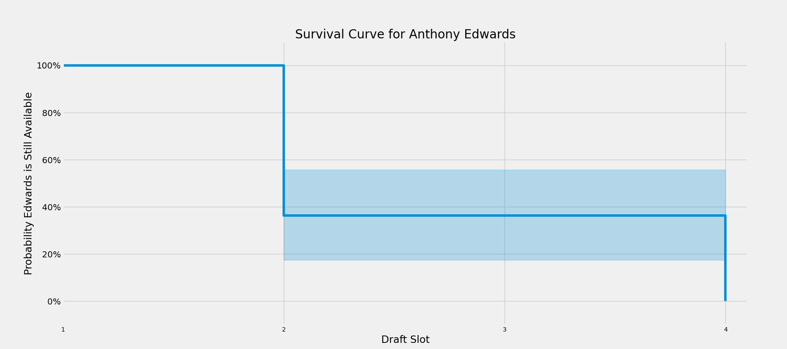
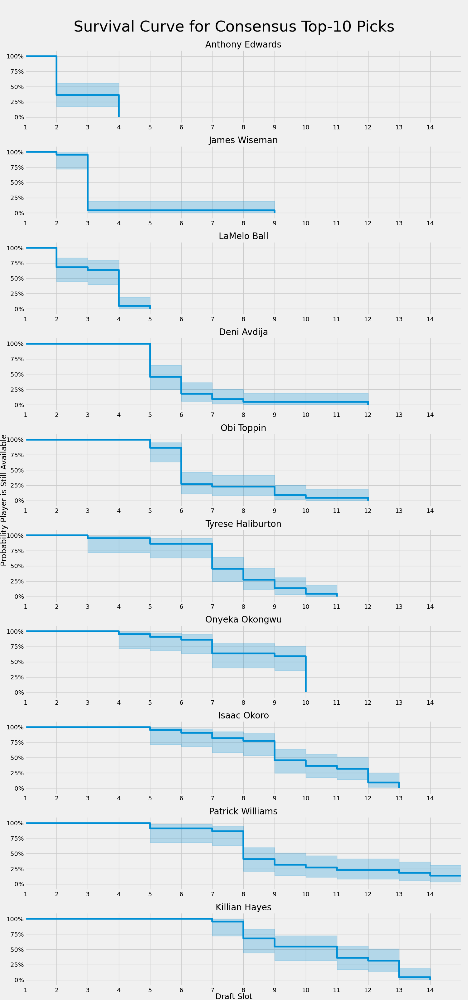
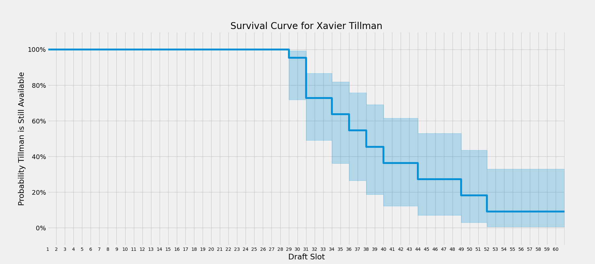
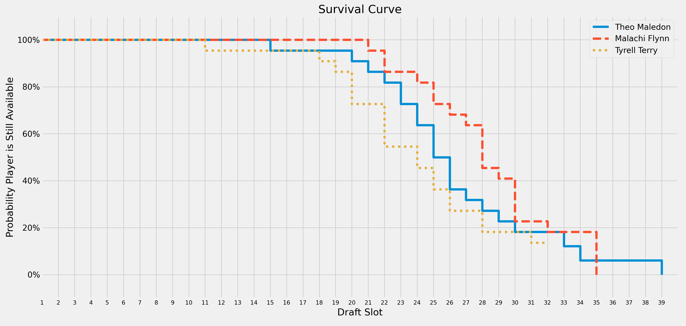

 <h1>NBA Draft Survival Analysis</h1> 

 <h3>Updated November 16, 2020</h3> 

---
#### Motivation
In preparation for the 2020 NBA Draft, I wanted to analyze when each prospect was likely to be selected. Compiling over 20 mock drafts from various draft analysts, I created a survival analysis which calculated the probability of each prospect being available at each draft slot.

As an example, the following plot illustrates the probability that Anthony Edwards is available at each draft slot. Moving from left to right on the x-axis, we observe that based on the compiled mock drafts there is ~55% probability Edwards is available at pick number 2 and ~50% probability he is available at pick number 3.

 

Survival analysis is typically used to calculate the probability of death occurring at a given age for subsets of the population. In this case, I'm substituting being drafted for death and draft slot for age. The time between the start of the analysis and when the event of interest occurs is called survival time, which in this case is the number of draft slots that a player is still available in each mock draft.

The analysis calculates probabilities for picks 1-60. Not all players were included in each mock draft and not every mock draft ranked players 1-60 with most only ranking through the first round. Since those players were never observed I've considered them right-censored. This means that we have some information about their expected selection, in most cases they were not selected picks 1-30, but not the exact slot in which the analyst had them mocked. Due to this constraint, I've used the Kaplan-Meier estimator to calculate the survival curve of each prospect.

#### Mock Drafts

Each player's survival curve is based on information compiled from over 20 mock drafts listed below. I've not included the underlying data in this repo as some mocks are behind a paywall, but have stated when each was last updated. I'll check for updates and re-run the analysis on a weekly basis in the run-up to the draft. If you see any updates I've missed or mocks I should add let me know! Thanks to all of these individuals who publish their mock drafts, especially to those who do it in tabular form.

| Name  | Affiliation  | Updated  | Mock Draft  |
|---|---|---|---|
| Babcock Hoops  | Babcock Hoops  | November 2  | [Link](https://www.babcockhoops.com/mockdraft)  |
| Bryan Kalbrosky  | Rookie Wire  | October 22  | [Link](https://therookiewire.usatoday.com/lists/2020-nba-mock-draft-all-60-picks-post-combine/)  |
| Chad Ford | NBA Big Board | November 15 | [Link](https://nbabigboard.com/mock-draft-2-0/) |
| Chad Forsberg  | NBC Sports  | October 29  | [Link](https://www.nbcsports.com/boston/celtics/2020-nba-mock-draft-90-best-players-available-fit-team-needs)  |
| Chris Stone  | Sporting News  | March 24  | [Link](https://www.sportingnews.com/us/nba/news/nba-mock-draft-2020-warriors-pick-timberwolves-lamelo-ball/178cr8zivu85e1qdtavgxp9cc2)  |
| Danny Cunningham  | Complex  | November 2  | [Link](https://www.complex.com/sports/nba-mock-draft-pre-nba-draft/)  |
| Gary Parrish  | CBS Sports  | November 13  | [Link](https://www.cbssports.com/nba/draft/mock-draft/)  |
| James Ham  | NBC Sports | November 16  | [Link](https://www.nbcsports.com/bayarea/warriors/2020-nba-mock-draft-210-first-round-pick-projections-final-week)  |
| Jeff Goodman  | Stadium  | August 21  | [Link](https://watchstadium.com/jeff-goodmans-2020-nba-mock-draft-3-0-lottery-order-revealed-08-20-2020/)  |
| Jeremy Woo  | Sports Illustrated  | November 16  | [Link](https://www.si.com/nba/2020/11/16/nba-mock-draft-latest-updates-rumors-daily-cover)  |
| John Hollinger | The Athletic | November 10 | [Link](https://theathletic.com/2188482/2020/11/10/2020-nba-mock-draft-whos-going-where-in-the-first-round/) |
| Jonathan Givony  | ESPN  | November 16  | [Link](https://www.espn.com/nba/insider/story/_/id/30286832/nba-mock-draft-our-latest-intel-most-likely-picks-trades)  |
| Jonathan Wasserman  | Bleacher Report  | November 16  | [Link](https://bleacherreport.com/articles/2917825-bleacher-reports-final-2020-nba-mock-draft)  |
| Kevin O'Connor  | The Ringer  | November 12 | [Link](https://nbadraft.theringer.com/)  |
| Krysten Peek  | Yahoo Sports  | November 5  | [Link](https://sports.yahoo.com/2020-nba-mock-draft-60-la-melo-ball-remains-no-1-163601345.html)  |
| Kyle Boone  | CBS Sports  | November 13  | [Link](https://www.cbssports.com/nba/draft/mock-draft/)  |
| NBAdraftnet | NBAdraftnet | November 14 | [Link](https://www.nbadraft.net/nba-mock-drafts/) |
| NetScouts  | NetScouts  | November 13  | [Link](https://netscoutsbasketball.com/scouting/2020-nba-mock-draft/)  |
| Ricky O'Donnell  | SB Nation  | November 5  | [Link](https://www.sbnation.com/nba/2020/11/5/21546769/nba-mock-draft-2020-lamelo-ball-anthony-edwards-warriors-bulls-rumors)  |
| Sam Veceine  | The Athletic  | November 16  | [Link](https://theathletic.com/2198283/2020/11/16/2020-nba-draft-order-mock-draft-lamelo-ball-james-wiseman-anthony-edwards-live-updates-team-fit/)  |
| Scott Gleeson  | USA Today  | November 12  | [Link](https://www.usatoday.com/story/sports/nba/2020/11/12/nba-mock-draft-lamelo-ball-anthony-edwards-no-1-pick/6235919002/)  |
| Tankathon  | Tankathon  | November 15  | [Link](http://www.tankathon.com/mock_draft)  |

#### Consensus Top-3 Picks

Based on the average draft slot across all mock drafts Anthony Edwards (2.04), LaMelo Ball (2.09), and James Wiseman (2.54) are the consensus top three picks. Their respective survival curves are plotted below. At this point in time Edwards and Ball are a toss up as to who goes first overall. However, Wiseman then has the highest probability of going second.

#### Consensus Top-10 Picks

In similar fashion, here are the survival curves of the consensus top-10 picks.

#### Case Studies

At this point the mock drafts have Anthony Edwards as the most likely first overall pick just ahead of LaMelo Ball. There's ~55% probability he is available at the number two pick and ~50% chance he is available at the third pick. Based on the mocks there is no chance he falls to the 4th pick.

 

Xavier Tillman provides a good example of a player likely to go in the middle of the draft. Based on the mock drafts, he is unlikely to be selected prior to the 28th pick. After then his probability of being available decreases at a steady rate.

 

Kenyon Martin Jr. is a player on the fringe of being drafted. The mock drafts have him unlikely to be selected prior to pick number 50. In total, there is ~65% probability he goes undrafted.

 

Hopefully this analysis provides additional information for teams on when targeted players might be available during the draft. As a final example, if you're a hypothetical team targeting a point guard outside of the lottery you can compare survival curves to better predict when a player will be available. In this case, if you value Terry over Maledon and Flynn you'll need to be more aggressive in moving up to get him as he's likely to be gone before the other two.

 

#### Dashboard
To interactively filter to a specific player, visit the accompanying [dashboard](https://chrisfeller.shinyapps.io/nba_draft_survival_analysis_app/?_ga=2.67843986.2071066075.1603058532-829731406.1603058532).

#### References
1. [Lifelines Package Documentation](https://lifelines.readthedocs.io/en/latest/index.html)
2. Emily Zabor - *[Survival Analysis in R](https://www.emilyzabor.com/tutorials/survival_analysis_in_r_tutorial.html#part_1:_introduction_to_survival_analysis)*
3. Savvas Tjortjoglou - *[Surviving the NFL](http://savvastjortjoglou.com/nfl-survival-analysis-kaplan-meier.html)*
